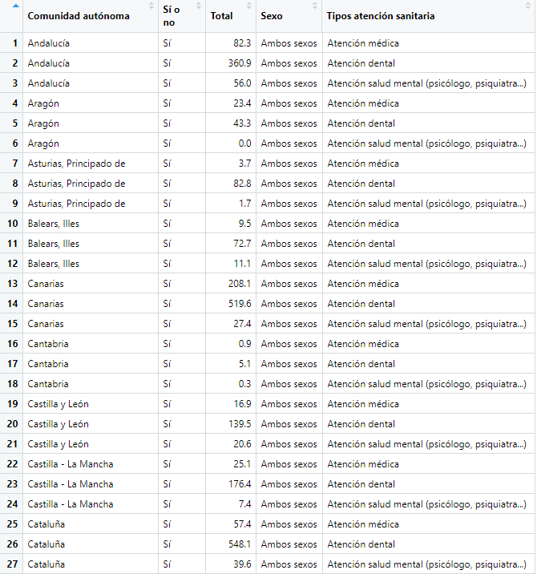
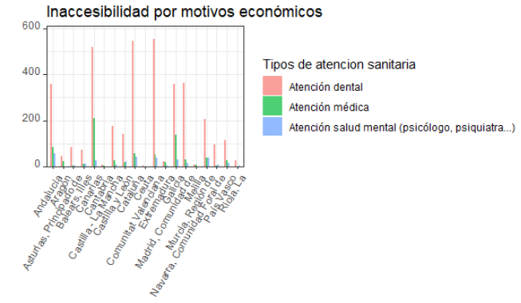
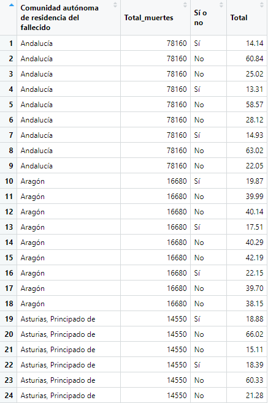
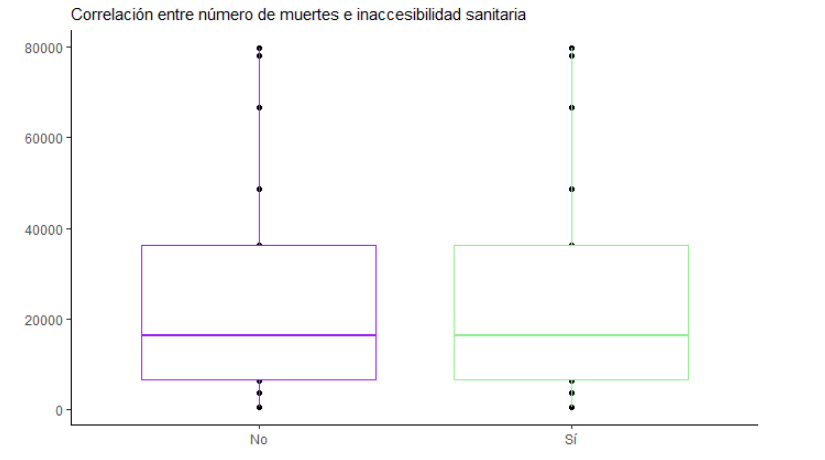
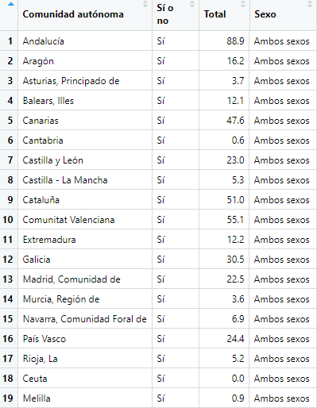
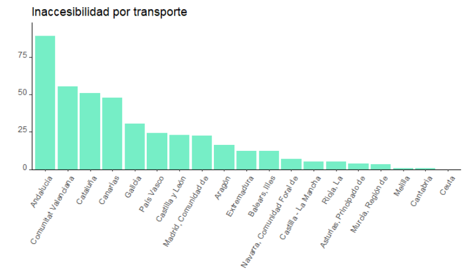
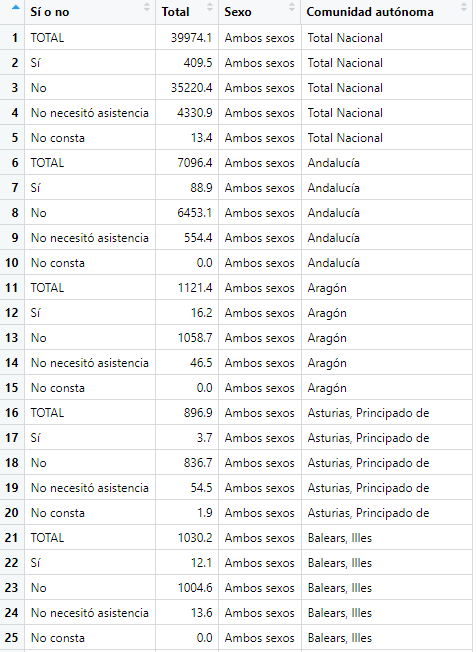
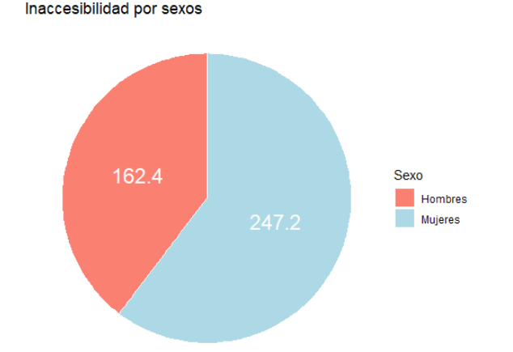

```{r setup, include= FALSE}
knitr::opts_chunk$set(echo = FALSE)
```

<center>
<h1> Inaccesibilidad sanitaria y efectos en salud
</center>

```{r, fig.align='center', out.width="400px"}
library(knitr)
include_graphics("Inaccesibilidad.png")
```

\

<center>
<h3> Lorena González, Alba Miguel, Noelia Pérez
</center>


## Índice

1. Introducción
2. Objetivos
  \
  2.1. Objetivo general
  \
  2.2. Objetivos específicos
3. Metodología
  \
  3.1. Procesamiento de datos
  \
  3.2. Descripción del set de datos
  \
  3.3. Resolución temporal
  \
  3.4. Resolución espacial
  \
  3.5. Población
  \
  3.6. Herramientas utilizadas: Datos
  \
    - 3.6.1. Análisis de datos
    \
    - 3.6.2. Gráficos
    \
    - 3.6.3. Conclusiones
  

## Introducción


La **inaccesibilidad** se define como aquello que no está accesible, es decir, sin acceso o trato.

A través de este trabajo analizaremos algunos de los aspectos que actualmente desencadenan situaciones de inaccesibilidad en las distintas comunidades autónomas de España. Entre otros, la inaccesibilidad por dificultades económicas o de transporte.

El informe consta de diferentes partes. En primer lugar, presentaremos los objetivos. Después desarrollaremos la metodología que vamos a utilizar para abordar cada uno de ellos, y por último, incidiremos en la importación y el análisis de los datos,así como las correspondientes conclusiones.

Vamos a abordar este tema, ya que nos parece que es uno de los problemas que concierne a la sociedad en la actualidad y que se ha intensificado por la pandemia.  


## Objetivos

*OBJETIVO GENERAL*: 

Comprobar la relación entre la inaccesibilidad a la sanidad y los efectos que puede provocar en la salud humana.

*OBEJTIVOS ESPECÍFICOS*:

-Inaccesibilidad por motivos económicos y comunidad autónoma.

-Relación entre los casos de muerte y la inaccesibilidad (por comunidad autónoma).

-Inaccesibilidad y dificultades de transporte (por comunidad autónoma).

```{r, fig.align='center', out.width="350px"}
library(knitr)
include_graphics("barreras_salud.jpg")
```

## Metodología

* **Procesamiento de datos**

Hemos extraído los datos del **Instituto Nacional de Estadística (INE)**. El INE es un organismo autónomo de carácter administrativo, con personalidad jurídica y patrimonio propio, adscrito al Ministerio de Asuntos Económicos y Transformación Digital a través de la Secretaría de Estado de Economía y Apoyo a la Empresa.Ver [aquí](https://www.ine.es/index.htm)

<div>
<p style = 'text-align:center;'>

</p>
</div>


## Metodología

**Datos**: 

- [Inaccesibilidad por motivos económicos](https://www.ine.es/jaxi/Tabla.htm?path=/t15/p420/a2019/p02/l0/&file=05016.px&L=0)

- [Defunciones por comunidad autónoma](https://www.ine.es/jaxi/Datos.htm?tpx=21856)

- [Demora excesiva o inaccesibilidad a la asistencia médica](https://www.ine.es/jaxi/Tabla.htm?path=/t15/p419/a2017/p02/l0/&file=05004.px&L=0)

- [Inaccesibilidad por dificultades con el transporte](https://www.ine.es/jaxi/Tabla.htm?path=/t15/p420/a2019/p02/l0/&file=05010.px&L=0)

## Metodología

* **Resolución temporal**
\
Últimos 12 meses del año 2020.


* **Resolución espacial**
\
Por comunidades autónomas de España.


* **Población**
\
Personas de 15 o más años, tanto hombres como mujeres, excepto en el set de datos de defunciones por comunidad autónoma, que incluye todos los rangos de edad.

## Metodología
* **Herramientas utilizadas**

**Inaccesibilidad por motivos económicos**

Tras filtrar los datos de inaccesibilidad sanitaria por motivos económicos agrupando por comunidad autónoma y tipo de atención médica obtenemos:


```{r, fig.align='center', out.width="500px"}
library(knitr)

```

## Metodología
**Herramientas utilizadas**

**Conclusión 1**
En el gráfico anterior se muestran las personas que han sufrido inaccesibilidad  a la asistencia sanitaria por motivos económicos.

Hemos realizado la comparación por Comunidades Autónomas por orden alfabético y en el eje y, el total de los datos. Hemos gráficado segun los tres tipos de asistencia sanitaria: La atención dental (rosa), la atención médica (verde) y la salud mental (azul), por lo que para cada una de las comunidades autonomas vamos a obtener tres barras.

Podemos obtener estas conclusiones, respecto a la salud dental destaca la Comunidad Valenciana seguida de Cataluña, en la salud médica tenemos que destacar a las Islas Canarias junto a Extremadura como las Comunidades que más han sufrido inaccesibilidad por este motivo. Y finalmente hablando de la salud mental, las Comunidades que han sufrido una mayor inaccesibilidad sanitaria son Andalucía y Cataluña.

```{r, fig.align='center', out.width="650px"}
library(knitr)

```


## Metodología
* **Herramientas utilizadas**

**Relación casos de muerte e inaccesibilidad.**

Tras realizar el full join empleando como pivote la variable "Comunidad Autónoma" obtenemos:

```{r, fig.align='center', out.width="380px"}
library(knitr)

```

## Metodología

* **Herramientas utilizadas**

**Conclusión 2**

En el gráfico se muestra la relación entre la inaccesibilidad a la asistencia sanitaria y el total de defunciones por comunidad autónoma. 
En un principio creíamos que en aquellas comunidades en las que hay una mayor inaccesibilidad sanitaria, la tasa de mortalidad también sería mayor. Sin embargo, tal como muestra el box-plot, la inaccesibilidad parece no ser un determinante, o al menos no en gran medida, sobre el total de muertes que se producen a nivel nacional. 


```{r, fig.align='center', out.width="650px"}
library(knitr)

```

## Metodología
* **Herramientas utilizadas**

**Inaccesibilidad por dificultades en el transporte según la comunidad autónoma.**

En primer lugar, estudiamos el rango de inaccesibilidad sanitaria o demora excesiva producido por dificultades en el transporte, en función de la comunidad autónoma.

```{r, fig.align='center', out.width="380px"}
library(knitr)

```

## Metodología
* **Herramientas utilizadas**

**Conclusión 3.1**

En el gráfico se muestran las personas que han sufrido inaccesibilidad o demora excesiva a la asistencia sanitaria debido al transporte o la distancia.
La comparación que hemos realizado es por comunidades autónomas y hemos ordenado en el eje X, teniendo en cuenta los valores de mayor a menor del eje Y. Las conclusiones que podemos sacar son las siguientes: la comunidad que más ha sufrido es Andalucía, seguida de la Comunidad Vañenciana. En cambio, las que menos Cantabria y las ciudades de Ceuta y Melilla.Además les siguen de cerca Murcia, Asturias y la Rioja. En el medio con valores medios nos encontramos por ejemplo a País Vasco, Castilla Y León y Madrid.

```{r, fig.align='center', out.width="700px"}
library(knitr)

```

## Metodología
* **Herramientas utilizadas**

**Inaccesibilidad por dificultades en el transporte según la comunidad autónoma.**

En segundo lugar, estudiamos el rango de inaccesibilidad sanitaria o demora excesiva producido por dificultades en el transporte, en función del sexo.
```{r, fig.align='center', out.width="340px"}
library(knitr)

```

```{r, fig.align='center', out.width="240px"}
library(knitr)
include_graphics("datos_filtrados_3.2.PNG")
```

## Metodología
* **Herramientas utilizadas**

**Conclusión 3.2**

En el gráfico anterior se muestran las personas que han sufrido inaccesibilidad o demora excesiva a la asistencia sanitaria debido al transporte o la distancia.
\
La comparación que hemos realizado es por sexos, es decir, entre hombres y mujeres. Podemos observar que hay una diferencia entre sexos notable, las mujeres han sufrido mayor inaccesibilidad que los hombres, un un total de 247.2 frente al de los hombres de 162,4.
Nos imaginabamos que saldria una diferencia, pero no nos esperabamos que fuera tan grande. 
\
En conclusión, este podría ser un ejemplo de nuestra sociedad donde una vez más los datos muestran como las mujeres sufren un grado de exclusión mayor. Tal vez, los resultados de este estudio pueden ser un punto de partida para el desarrollo de políticas sanitarias y de protocolos institucionales más igualitarios para todo el mundo.

```{r, fig.align='center', out.width="500px"}
library(knitr)

```

## Slide with R Output

```{r cars, echo = TRUE}
summary(cars)
```

## Slide with Plot

```{r pressure}
plot(pressure)
```

